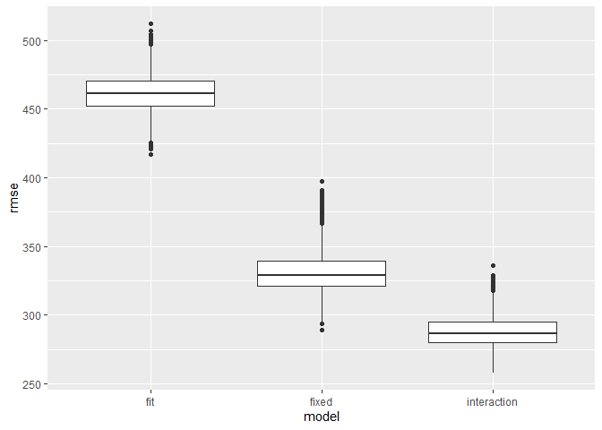

p8105\_hw6\_ar4173
================
Anand Rajan
12/2/2021

## Problem 1

Importing Data and Checking Missing Data

``` r
birthweight =
  read_csv(file = "./data/birthweight.csv") %>% 
  drop_na()
```

    ## Rows: 4342 Columns: 20

    ## -- Column specification --------------------------------------------------------
    ## Delimiter: ","
    ## dbl (20): babysex, bhead, blength, bwt, delwt, fincome, frace, gaweeks, malf...

    ## 
    ## i Use `spec()` to retrieve the full column specification for this data.
    ## i Specify the column types or set `show_col_types = FALSE` to quiet this message.

Data Cleaning and Converting Numeric Variables to Factor Variables where
appropriate

``` r
birthweight_df =
birthweight %>% 
  mutate(babysex = factor(babysex,
                          levels = c(1, 2),
                          labels = c("Male", "Female"))) %>% 
  mutate(frace = factor(frace,
                        levels = c(1, 2, 3, 4, 8, 9),
                        labels = c("White", "Black", "Asian", "Puerto Rican", "Other", "Unknown"))) %>% 
  mutate(malform = factor(malform,
                          levels = c(0, 1),
                          labels = c("Absent", "Present"))) %>% 
  mutate(mrace = factor(mrace,
                        levels = c(1, 2, 3, 4, 8),
                        labels = c("White", "Black", "Asian", "Puerto Rican", "Other")))

str(birthweight_df)
```

    ## tibble [4,342 x 20] (S3: tbl_df/tbl/data.frame)
    ##  $ babysex : Factor w/ 2 levels "Male","Female": 2 1 2 1 2 1 2 2 1 1 ...
    ##  $ bhead   : num [1:4342] 34 34 36 34 34 33 33 33 36 33 ...
    ##  $ blength : num [1:4342] 51 48 50 52 52 52 46 49 52 50 ...
    ##  $ bwt     : num [1:4342] 3629 3062 3345 3062 3374 ...
    ##  $ delwt   : num [1:4342] 177 156 148 157 156 129 126 140 146 169 ...
    ##  $ fincome : num [1:4342] 35 65 85 55 5 55 96 5 85 75 ...
    ##  $ frace   : Factor w/ 6 levels "White","Black",..: 1 2 1 1 1 1 2 1 1 2 ...
    ##  $ gaweeks : num [1:4342] 39.9 25.9 39.9 40 41.6 ...
    ##  $ malform : Factor w/ 2 levels "Absent","Present": 1 1 1 1 1 1 1 1 1 1 ...
    ##  $ menarche: num [1:4342] 13 14 12 14 13 12 14 12 11 12 ...
    ##  $ mheight : num [1:4342] 63 65 64 64 66 66 72 62 61 64 ...
    ##  $ momage  : num [1:4342] 36 25 29 18 20 23 29 19 13 19 ...
    ##  $ mrace   : Factor w/ 5 levels "White","Black",..: 1 2 1 1 1 1 2 1 1 2 ...
    ##  $ parity  : num [1:4342] 3 0 0 0 0 0 0 0 0 0 ...
    ##  $ pnumlbw : num [1:4342] 0 0 0 0 0 0 0 0 0 0 ...
    ##  $ pnumsga : num [1:4342] 0 0 0 0 0 0 0 0 0 0 ...
    ##  $ ppbmi   : num [1:4342] 26.3 21.3 23.6 21.8 21 ...
    ##  $ ppwt    : num [1:4342] 148 128 137 127 130 115 105 119 105 145 ...
    ##  $ smoken  : num [1:4342] 0 0 1 10 1 0 0 0 0 4 ...
    ##  $ wtgain  : num [1:4342] 29 28 11 30 26 14 21 21 41 24 ...

### Model Building

Included the following variables in my model as I hypothesized they
would have an impact on the baby’s birth weight based previous
literature

gaweeks: Gestational Age in Weeks, I hypothesize that the longer the
gestational age is the greater the baby birth weight

wtgain: Mother’s weight gain during pregnancy(pounds), I hypothesize
that the greater the weight gain during pregnancy, the greater the
baby’s birth weight

momage: Mother’s age at delivery(years), I hypothesize that as the age
of the mother increases, the baby’s birth weight decreases

malform: Presence of malformations that could affect weight (0 = absent,
1 = present), I hypothesize that the presence of malformations will
decrease the baby’s birth weight on average

smoken: Average number of cigarettes smoked per day during pregnancy, I
hypothesize that the greater the average number of smoked cigarettes per
day, the lower the baby birth weight

smoken\*malform: Interaction term between average number of cigarettes
smoked and presence of malformations, I hypothesize the interaction is
significant

``` r
fit_mod= lm(bwt ~ gaweeks+ wtgain + momage + malform + smoken + (smoken*malform), data = birthweight_df )
fit_mod %>% broom::tidy()
```

    ## # A tibble: 7 x 5
    ##   term                  estimate std.error statistic   p.value
    ##   <chr>                    <dbl>     <dbl>     <dbl>     <dbl>
    ## 1 (Intercept)             224.      89.7        2.49 1.27e-  2
    ## 2 gaweeks                  60.5      2.21      27.4  2.01e-152
    ## 3 wtgain                    9.65     0.635     15.2  8.00e- 51
    ## 4 momage                   15.9      1.79       8.86 1.10e- 18
    ## 5 malformPresent          209.     150.         1.39 1.63e-  1
    ## 6 smoken                   -6.99     0.929     -7.53 6.34e- 14
    ## 7 malformPresent:smoken   -27.1     11.3       -2.39 1.70e-  2

``` r
fit_mod %>% broom::glance()
```

    ## # A tibble: 1 x 12
    ##   r.squared adj.r.squared sigma statistic   p.value    df  logLik    AIC    BIC
    ##       <dbl>         <dbl> <dbl>     <dbl>     <dbl> <dbl>   <dbl>  <dbl>  <dbl>
    ## 1     0.229         0.228  450.      215. 1.17e-240     6 -32684. 65383. 65434.
    ## # ... with 3 more variables: deviance <dbl>, df.residual <int>, nobs <int>

From analyzing the p-values and model coefficients, the predictor
variables are significant with the exception of malformpresent.
Malformpresent was the only variable that did not have a significant
p-value (p-value = 0.163). Though the overall r-squared is low for the
model(r-squared = 22.92%), the p-value for the model is significant.
Furthermore, given background literature and my hypotheses, we will
proceed forward with these variables in the model as we deem these
predictor variables are essential for understanding factors that affect
baby birthweight.

Now let us evaluate the residuals

``` r
residual_plot =
birthweight_df %>% 
  add_predictions(fit_mod) %>% 
  add_residuals(fit_mod) %>% 
  ggplot(aes(x=pred, y=resid)) +
  geom_point()  +
  geom_smooth(method= "lm", se = FALSE) +
  labs(x= "Predicted Birthweight(grams)", y="Residual",title = "Model Predictions vs Residuals")

residual_plot
```

    ## `geom_smooth()` using formula 'y ~ x'

<!-- -->

From looking at the graph we see that the residuals are somewhat
randomly scattered around 0, thus the assumption of homoscedasticity is
not violated. There is a bit of clustering but this is moreso related to
how all the fitted values are not equally frequent.

Now lets compare the created model to the other two models

``` r
fixed_mod = lm(bwt ~ blength + gaweeks, data=birthweight_df)
interaction_mod = lm(bwt ~ bhead + blength + babysex + bhead*blength + bhead*babysex + blength*babysex, data=birthweight_df)
```

Cross Validate to Comparison Models

``` r
set.seed(7777)

cv_df =
  crossv_mc(birthweight_df, n=4342, test = 0.15) %>% 
  mutate(
    train = map(train, as_tibble),
    test = map(test, as_tibble)) %>% 
  mutate(
    fit_mod  = map(train, ~lm(bwt ~ gaweeks +  momage + malform + smoken + (smoken*malform), data = birthweight_df )),
    fixed_mod  = map(train, ~lm(bwt ~ blength + gaweeks, data=birthweight_df)),
    interaction_mod = map(train, ~lm(bwt ~ bhead + blength + babysex + bhead*blength + bhead*babysex + blength*babysex, data=birthweight_df))) %>% 
  mutate(
    rmse_fit = map2_dbl(fit_mod, test, ~rmse(model = .x, data = .y)),
    rmse_fixed = map2_dbl(fixed_mod, test, ~rmse(model = .x, data = .y)),
    rmse_interaction = map2_dbl(interaction_mod, test, ~rmse(model = .x, data = .y)))
```

``` r
cv_boxplot =
cv_df %>% 
  select(starts_with("rmse")) %>% 
  pivot_longer(
    everything(),
    names_to = "model", 
    values_to = "rmse",
    names_prefix = "rmse_") %>% 
  mutate(model = fct_inorder(model)) %>% 
  ggplot(aes(x = model, y = rmse)) + geom_boxplot()

cv_boxplot
```

<!-- -->

By analyzing the box plot, we see that the RMSE of the constructed model
is much greater than compared to the other two models. Thus the
prediction accuracy of this model is much lower compared to the other
two models. Furthermore, based on the box plot, the interaction model
has the best prediction accuracy. Therefore, we should revisit the model
we constructed and possibly adjust or add predictor variables.

## Problem 2

Importing Data set

``` r
weather_df = 
  rnoaa::meteo_pull_monitors(
    c("USW00094728"),
    var = c("PRCP", "TMIN", "TMAX"), 
    date_min = "2017-01-01",
    date_max = "2017-12-31") %>%
  mutate(
    name = recode(id, USW00094728 = "CentralPark_NY"),
    tmin = tmin / 10,
    tmax = tmax / 10) %>%
  select(name, id, everything())
```

    ## Registered S3 method overwritten by 'hoardr':
    ##   method           from
    ##   print.cache_info httr

    ## using cached file: C:\Users\araja\AppData\Local/Cache/R/noaa_ghcnd/USW00094728.dly

    ## date created (size, mb): 2021-10-07 02:26:40 (7.617)

    ## file min/max dates: 1869-01-01 / 2021-10-31

Bootstrapping the Weather Dataset

``` r
bootstrap_weather =
  bootstrap(weather_df, 5000) 

as_data_frame(bootstrap_weather$strap[[1]])
```

    ## Warning: `as_data_frame()` was deprecated in tibble 2.0.0.
    ## Please use `as_tibble()` instead.
    ## The signature and semantics have changed, see `?as_tibble`.
    ## This warning is displayed once every 8 hours.
    ## Call `lifecycle::last_warnings()` to see where this warning was generated.

    ## # A tibble: 365 x 6
    ##    name           id          date        prcp  tmax  tmin
    ##    <chr>          <chr>       <date>     <dbl> <dbl> <dbl>
    ##  1 CentralPark_NY USW00094728 2017-09-14     5  27.2  21.1
    ##  2 CentralPark_NY USW00094728 2017-02-08     8  16.7   3.3
    ##  3 CentralPark_NY USW00094728 2017-01-22    13   8.9   6.1
    ##  4 CentralPark_NY USW00094728 2017-04-22    28  13.9   9.4
    ##  5 CentralPark_NY USW00094728 2017-07-13     0  32.2  22.8
    ##  6 CentralPark_NY USW00094728 2017-09-21     0  26.7  21.7
    ##  7 CentralPark_NY USW00094728 2017-10-20     0  22.8  13.9
    ##  8 CentralPark_NY USW00094728 2017-11-28     0  12.2   2.2
    ##  9 CentralPark_NY USW00094728 2017-04-16     0  30.6  15  
    ## 10 CentralPark_NY USW00094728 2017-08-07   193  21.7  17.8
    ## # ... with 355 more rows

Calculating r^2 and log(β^0 ∗ β^1) for each bootstrap sample

``` r
bootstrap_results=
bootstrap_weather %>% 
  mutate(
    models = map(strap, ~lm(tmax ~ tmin, data=.x)),
    results = map(models, broom::tidy),
    glance = map(models, broom::glance)) %>% 
  select(-strap,-models) %>% 
  unnest(glance,results) %>% 
  group_by(.id)
```

    ## Warning: unnest() has a new interface. See ?unnest for details.
    ## Try `df %>% unnest(c(glance, results))`, with `mutate()` if needed

``` r
bootstrap = 
  bootstrap_results %>% 
  select(.id, estimate, term, r.squared, adj.r.squared) %>% 
  pivot_wider(names_from = term, values_from = estimate) %>% 
  janitor::clean_names() %>% 
  mutate(log_var = log(intercept * tmin)) 
```

\#\#\#Distributions of R^2 and log(β^0 ∗ β^1)

``` r
r_squared_distribution = 
  bootstrap %>% 
  ggplot(aes(x = r_squared)) +
  geom_density(alpha = 0.2) +  
  labs(title = "Distribution of r2")

r_squared_distribution
```

<!-- -->

``` r
log_var_distribution =
  bootstrap %>% 
  ggplot(aes(x = log_var)) +
  geom_density(alpha = 0.2) +
  labs(title = "Distribution of log_var")

log_var_distribution
```

<!-- -->

Both distributions look approximately normal.

``` r
r_squared_bounds = 
  quantile(pull(bootstrap, r_squared), probs = c(.025, 0.975), names = FALSE, type = 4)

log_var_bounds = 
  quantile(pull(bootstrap, log_var), probs = c(.025, 0.975), names = FALSE, type = 4)

data.frame(estimate = c("r_squared", "log_var"),
          lower_bound = c(r_squared_bounds[[1]], log_var_bounds[[1]]),
          upper_bound = c(r_squared_bounds[[2]], log_var_bounds[[2]]))
```

    ##    estimate lower_bound upper_bound
    ## 1 r_squared   0.8943079   0.9269558
    ## 2   log_var   1.9642005   2.0583901

The bounds of log\_var are 1.97 and 2.06. The bounds for r-squared are
0.89 and 0.93.
